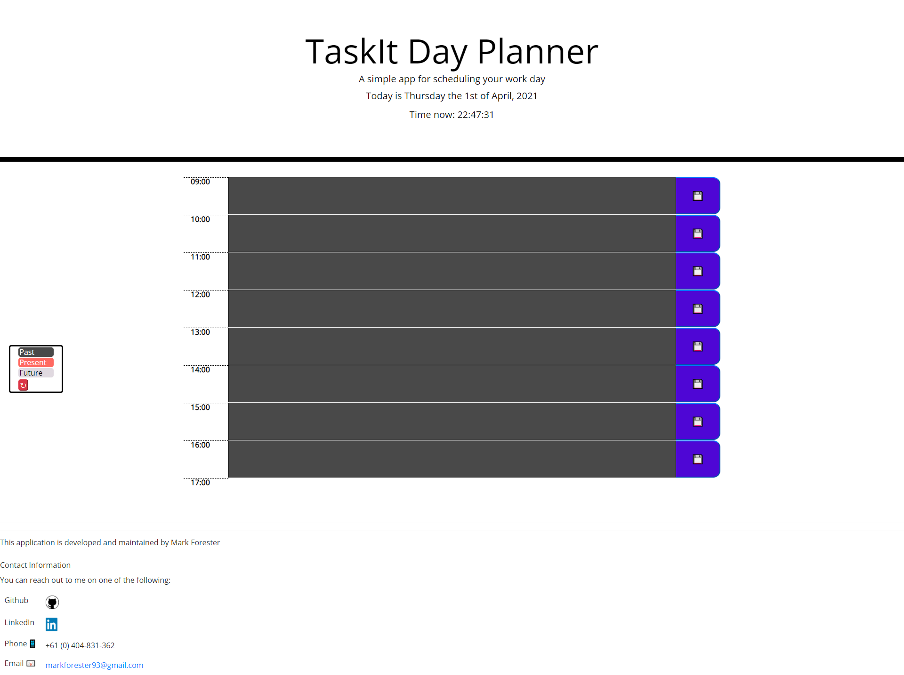

# TaskIt Day Planner

## Description

TaskIt is a user-friendly, low-resource interface that uses the local storage and the local time and date on the machine to plan your work day ahead of you.

### Usage

## Link to the Deployed Application

[TaskIt Planner](https://forester93.github.io/Task-It/)

## Link to the Github Repository

[TaskIt Planner Github Repo](https://github.com/Forester93/riddle-me-quiz/)

## Screenshot of the Application

## Contact me

| Name          | Email                    | Phone Numer         |
| ------------- | ------------------------ | ------------------- |
| Mark Forester | markforester93@gmail.com | +61 (0) 404-831-362 |

## Commits for this Application

### First Commit

• Created the markdown file.

### Second Commit

• Added time funcitonality in the page header.  
• Added basic blocks for business hours.  
• Added reset.css file.  
• Added screenshot for the page.

### Third Commit

• Added time-dependent colour-coding function.
• Added a page footer.
• Added a colour legend.
